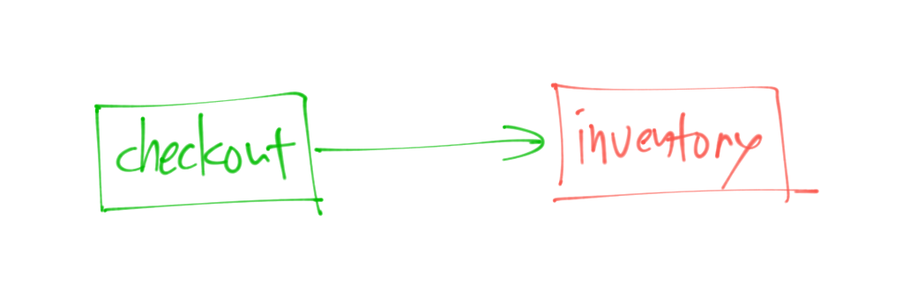
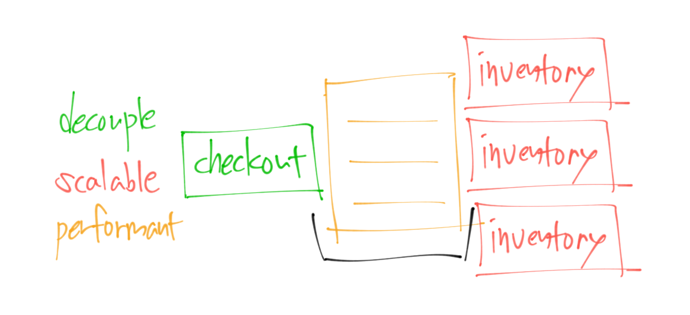
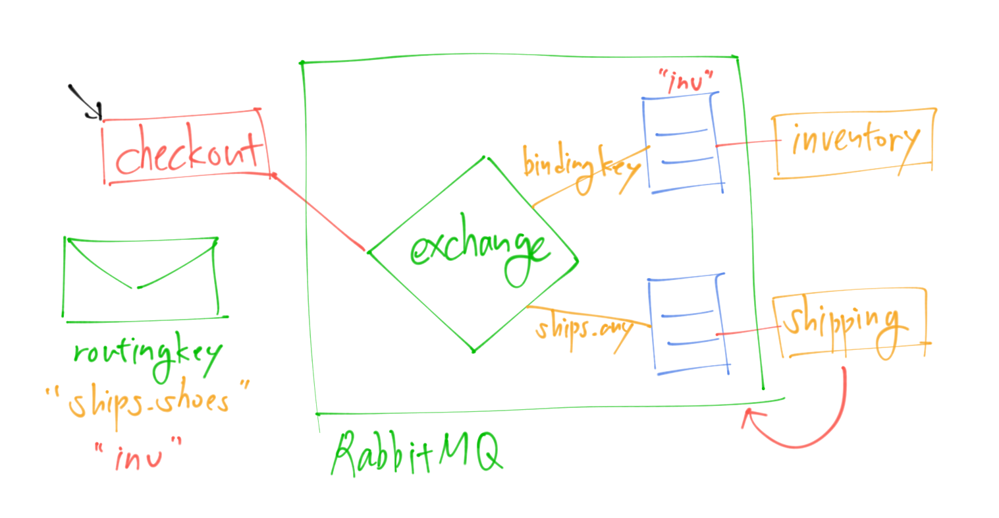

## 서론

인턴을 하던 회사에 첫 취업을 하고 UMS 개발 프로젝트를 맡게 되었다.

>   🧐 UMS란? 
    UMS(Unified Messaging System, 통합메세징시스템)란 기존에 개별적으로 서비스되던 음성사서함, 팩스사서함, 자동응답, e메일 시스템을 통합한 것으로 사업자는 시스템도입비용을 줄이고 가입자는 단말기의 종류에 상관없이 개인메세지를 관리할 수 있다.

우리 회사에서는 UMS로 기업이 SMS, MMS, 카카오 알림톡, 대용량 이메일 등을 다양한 형태의 메세지를 하나의 플랫폼에서 편리하게 이용할 수 있도록 하는 것 같다.

본격적으로 현재 팀에서 진행하고 있는 프로젝트에 대한 설명을 들으면서 RabbitMQ와 Redis를 사용하고 있었고, 이에 대해 공부해야겠다고 생각했다.

## 💬 메세지 큐와 메세지 브로커

모놀로식 아키텍쳐*(하나의 서비스 또는 애플리케이션이 하나의 거대한 아키텍처를 가지는 전통적인 아키텍처)* 시대에는 애플리케이션 구성요소가 긴밀하게 결합되어 있었다.

즉, 직접 연결되어있었다. 간단한 판매 애플리케이션 내에서 결제 서비스와 재고 서비스가 통신해야 되는 경우 일반적으로 TCP 연결을 통해 직접 수행된다.

하지만 이 경우에 몇가지 한계가 있었다.

결제시스템이 메세지를 보내자마자 다음 작업으로 넘어가기 전에 응답을 받아야 하는데, 최악의 경우에 재고 서비스가 다운되면 연결이 가능할 때까지 계속해서 시도한다는 것이다. 또는 한꺼번에 많은 결제가 발생하면 재고 서비스가 이를 따라잡지 못하고 전체 시스템이 정체될 수 있다. 

이것이 바로 메세지 큐, 즉 메세지 브로커가 만들어진 이유이며 메세지 큐는 서로 통신해야 하는 두 서비스 사이에 미들웨어로 위치하게 된다. 

### 메세지 큐의 장점

1. 분리(Decouple)
    
    메세지 큐를 사용하면 결제 시 큐에 메세지를 추가한 후, 즉시 다음 작업으로 이동할 수 있다. 그럼 다음 마찬가지로 재고 서비스가 준비되면 큐에서 메세지를 처리하고 즉시 그 다음 메세지를 처리할 수 있다. 따라서 메시지 큐로 인해 두 응용프로그램이 분리된다. 
    
2. 확장성(Scalable)
    
    메세지 브로커는 확장성도 높일 수 있다. 한꺼번에 많은 결제가 발생하면 큐가 채워지기 시작하고 하나 이상의 메세지 소비 서비스(위 그림의 `Inventory` 서비스)가 큐에서 읽어 처리할 수 있다. 결제 서비스가 생성하는 작업량이 늘어나고 시스템 확장성이 향상된다. 
    
3. 성능(Performent)
    
    메세지 큐의 또 다른 큰 장점은 큐 자체가 자체 시스템에 존재할 수 있다는 것이다. 따라서 이 경우에 웹 애플리케이션이 수행하는 작업 중 일부를 오프로드해서 전체 시스템의 성능을 향상시킬 수 있다.
    

## 🐇 RabbitMQ

RabbitMQ는 AMQP(Advanced Message Queuing Protocol) 메세지 모델의 구현이다. 이 유형의 메세지 모델을 사용하면 생산자(메세지를 생성하는 서비스)는 결제 서비스가 된다. 메세지 큐는 교환소(Exchange)에서 생성되는데, 쉽게 우체국이라고 생각하면 된다. 교환소는 모든 메세지를 수신한 다음 주소 지정 방법에 따라 배포하는데, 교환소는 많은 큐(대기열)에 연결될 수 있다. 예를 들어 아래 그림처럼 재고 서비스와 배송 서비스 두 가지에 연결할 수 있다.

결제 서비스는 교환소에 메세지를 보낸다. 교환은 바인딩이라는 연결을 통해 큐에 연결되고, 이러한 바인딩은 바인딩 키로 참조된다. 그런 다음 재고 서비스가 큐를 구독한다. AMQP, RabbitMQ는 여기서 메세지 브로커의 역할을 한다. 이 메세지 모델의 가장 큰 장점 중 하나는 메세지가 시스템을 통해 다양한 유형으로 유연하게 이동할 수 있다는 점이다.

### 메세지 교환 유형

1. Fan-out exchange
    
    Fan-out exchange을 사용하면 결제 메세지가 교환소에 생성되고 교환소는 메세지를 복제해서 알고 있는 모든 큐로 보내거나 직접 교환한다. 직접 교환의 경우, 결제 시 메세지가 생성되고, 해당 메세지는 라우팅 키를 받게 된다. 그리고 라우팅 키와 바운딩 키를 교환하여 정확히 일치하는 경우 해당 서비스로 이동하게 된다.
    
2. Topic exchange
    
    Topic exchange의 경우, 라우팅 키와 바인딩 키 사이의 부분 일치를 사용한다. 예를 들어 메세지에 `shiop.shoes`라는 라우팅 키가 있고, 바인딩 키가 `ship.any`이면 해당 메세지는 적절한 큐로 라우팅된다.
    
3. Hearder exchange
    
    Header Exchange를 사용하면 라우팅 키가 완전히 무시되고 메세지는 헤더에 따라 시스템을 통해 이동된다.
    
4. Default exchange
    
    마지막으로 RabbitMQ에만 고유하는 Default Exchange는 기본 교환인 라우팅 키를 사용해서 만약 이 메세지의 라우팅 키가 `inv`라고 가정하면, 라우팅 키는 큐 자체의 이름과 연결된다. 따라서 큐의 이름이 `inv`인 재고 서비스로 라우팅된다.
    

### RabbitMQ의 특징

- RabbitMQ의 큰 이점은 클라우드 친화적이라는 것이다. Docker 또는 기타 컨테이너화 소프트웨어에 인스턴스를 배포할 수 있다. 또한 클러스터로 실행될 수 있으므로 내결함성이 있고 가용성이 높으며 처리량이 높다.
- RabbitMQ는 교차 언어 통신을 할 수 있다. 결제 후 메세지가 생성되면 Javascript로 개발된 재고 서비스와 Python으로 개발된 배송 서비스 모두에서 처리할 수 있다.
- 보안이 우수하다.(FASL, LDAP, TLS 지원)
- 메세지 승인을 수행한다. 메세지는 큐에 존재하다가 소비 서비스에게 전달되면 소비자가 브로커에게 메세지 수신을 알릴 때까지 메세지는 큐에 유지된다. 소비 서비스가 메세지가 무사히 수신됐다고 브로커에게 알리면 메세지는 큐에서 제거되기 때문에 시스템에서 메세지가 손실되는 것을 방지할 수 있다.
- 관리가 용이하다. 브라우저 기반의 관리 UI와 추가적인 CLI 도구가 내장되어 있고, 그뿐만 아니라 오픈소스 커뮤니티에는 많은 플러그인들이 있다. RabbitMQ는 다른 메세지 모델(AMQP 091뿐만 아니라 MQTT, Stomp, AMQP 1.0등)을 지원할 정도로 발전했다.

## 결론

RabbitMQ를 사용하면 컨테이너화된 메세지 브로커를 통해 여러 서비스를 분리할 수 있고 따라서 과부하와 같은 예외적인 상황을 방지할 수 있다.

출처 [IBM Technology](https://youtu.be/7rkeORD4jSw?si=psWWrn-Gf9bkqtMp)